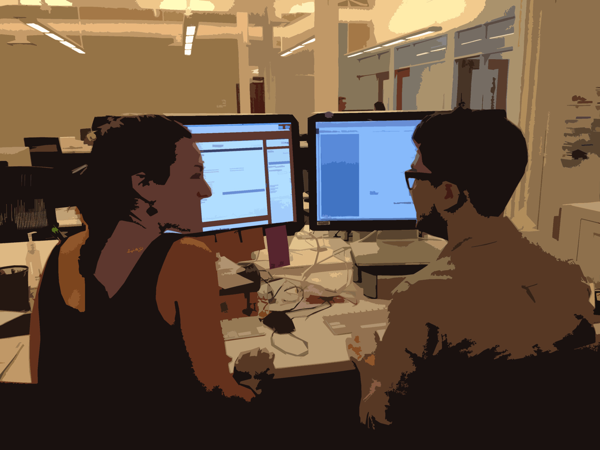
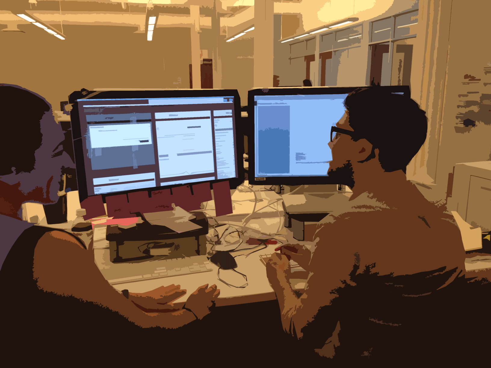

**Hi :-)**

---

# Pair Design for Fun and Profit

Asbury Agile, 2014

Jonathan Berger, Pivotal Labs

---

**Who Am I?**

- @jonathanpberger
- ~30 agile projects since ~2008
- design, code, product
- interested in agile practice for design

---

<!-- trying to take the Pair Design at Pivotal Labs doc as the structure -->

# How is design different for Agile?

- engineers build quickly, change rapidly
- demands different than what designers are accustomed to
- execution + enablement

---

## How to make design for agile successful?
- focus on the right questions
- keep pace with engineers
- build beautiful, functional product
- enable clients to do the same

---

# Why Pair Design?

---

## Better (Product) Design
- reduce the cost of change
- encourage convention, reduce trivial decisions
- reduce waste

---

## Better Designers
- promotes learning
- knowledge-transfer
- continuous improvement

---

## Better Teams
- help teams start from shared foundation
- make decisions collaboratively
- externalize and validate thinking

---

## Better Projects
- fresh eyes
- mesh complementary skill sets
- better Bus Count
- easier ramp-up
- facilitate rotation

---

## Better Product
- optimize for progress (not perfection)
- remove individual ego
- promote shared ownership of product

---

# How do we Pair design?

- similar techniques and philosophies as engineering
- design is different BUT
- core principles of communication, tight feedback loops
- Pair design takes a few forms. The three major standbys are:

---

## "Synth/Gen" Whiteboard pairing

- two people, one marker (cursor)

---

- two people, one marker (cursor)
- "Generator" has marker in hand, generate ideas
- "Synthesizer" stands back, asking, probing, edge cases, big picture

---

- map out feature sets or user-flows at about the epic level of granularity.

---

## Medium-Fidelity Illustrator Pairing

- when whiteboard-fidelity is no longer sufficient to make design decisions

---

- two visual designers building a Visual Design System

---

- i.e. building a visual metaphor for the object domain that they're mapping onto the product

---

- two mice plugged into one copy of illustrator
- trade off control of the cursor

---

- designers discuss the design challenge
- occasionally turn to the computer
- test out a feeling, illustrate an idea, or enshrine a decision.

---

## Stylesheet Pairing
- often called "cross-functional pairing"
- that's a misnomer

---

- two designers in the text editor, in the browser
- working on markup

---

- enshrine design decisions
- implement them on the front end of the site

---

<!-- # Pairing also introduces advantages which aren't available to solo design.

- When designing in front of working software (rather than static mock-ups), designers are able to generatively experiment and design in real-time.
- They can play more easily and natively with interactions, make changes at full-fidelity, and be creative in a way that's impossible in a mock-up.

 -->

## Cross-functional pairing

- difference w/ cross functional pairing:
- 2x designers pairing together == some skill transfer but similar perspective
- designer + developer == a lot more skill transfer,

---

## Benefits of Cross-Functional pairing

- no need to reproduce the design in mock-ups (time-consuming)
- no time spent marking up (for designer) and decoding (for developers) redlines
- developer learns the rationales behind the design decisions
- designer & dev move from adversarial context to collaborative context
- better unit cohesion, better bus-count, better collective ownership

---

# Troubleshooting techniques: Soloing

---

## Converge / Diverge / Converge

- hit an impasse?
- diverge for a short time (usually 10-30 minutes) to work through ideas solo
- re-converge, presenting their explorations, and continuing to pair

---

## Exquisite Corpse

- surrealist literary parlor game
- short timer (usually 10-30m), work on a design direction, pass it off
- Or, forego timer and just say "ready?" when stuck
- Ideally, several revolutions each hour
- rapid iteration, idea generation, refinement

---

## Double-Speed Documentation

- Once made, design decisions often have to be documented.
- Design pairs will split up to create the [Minimum Viable][] [DRY documentation][].
- Because there are two designers, they deliver in half the time.

---

# When do we pair?

- Dev == 100% pairing, design <100%
- Pairing is valuable whenever design decisions are being made
- documenting decisions made by the pair: divide and conquer (2x speed for the dull stuff!)

---

## Switch-hit pairing

- two projects, two designers
- solo mostly, but have context
- support each other when decisions need to be made
- block out ~1hr / day

---

# Questions?

---

## Thanks!

### <http://jonathanpberger.com/talks>

### Say hi on twitter at @jonathanpberger

### or jonathanpberger on github, gmail, forrst, etc...

---

---

# Extras!!

---

## Balanced Team & Pairing
- these are not existential claims
- It's not  "I am a developer I was born that way" or trained that way,
- it is "my role on this project developer or designer".

---

## Product people
- tend to be interdisciplinary
- first obligation: ensure backlog is healthy
- help conversation: "what do we need to do next? What does that look like? How's it enshrined?"

---

## Product Synth-Gen pairing
- When pairing with product designers via Synth-Gen
- strategic Step-Back, Higher- Level view of "How do these ideas comport with the rest of our system?"
- that's something that product for the most part can drop into any piece of

---

## Product Medium-Fidelity pairing
- Product tends to be good feedback for some of the illustrator pairing that we'll do
- less formally trained
- usually able to talk through user flows

---

# Pics (or it didn't happen)

---

## Pair Anywhere

---

- design office hours

---

- hurricane sandy

---

- stunt pairing

---

- remote pairing

---

## Pairing Arrangements

---

- sitting standing

---

- Tete-a-tete

---

- card sorting

---

- card sorting

---

## links

### <http://pivotallabs.com/minimum-viable-deliverable/>
### <http://pivotallabs.com/dry-documentation>
### <http://pivotallabs.com/big-design-refactor/>

[Minimum Viable]: <http://pivotallabs.com/minimum-viable-deliverable/>
[DRY documentation]: <http://pivotallabs.com/dry-documentation>
[different rhythms]: <http://pivotallabs.com/big-design-refactor/>

---

